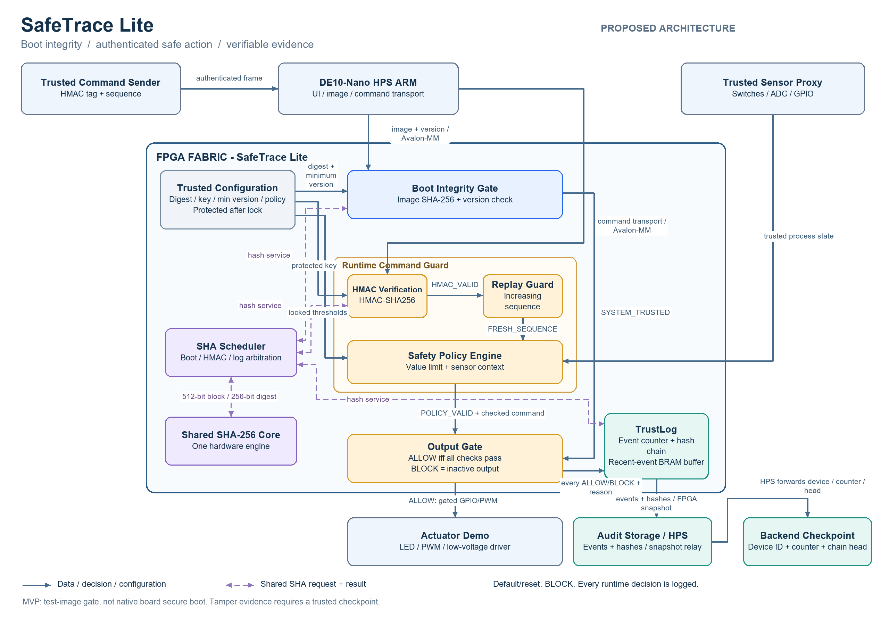

# Proposed SafeTrace Lite Architecture

Status: **Proposed Architecture / Pre-Implementation**. Source: proposal section 3.1, pp. 4-7, with boundaries from pp. 3-4. Module ports below are planned logical interfaces, not implemented RTL declarations; only widths explicitly present in the proposal are requirements. [Source notes](source-notes.md) record open decisions and software conventions.

## A. System Overview

The lifecycle is **Firmware Image → Boot Integrity Gate → Runtime Action Guard → Actuator → TrustLog → Audit Storage → Backend Verification**. This describes trust dependencies: TrustLog consumes the FPGA's decision event, not a physical feedback report from the actuator. A logged ALLOW demonstrates a gate decision; it does not prove a motor completed its movement.

1. HPS streams the test application image and version to the FPGA. Output remains BLOCK.
2. Boot Integrity Gate uses the shared SHA-256 engine to compare the image digest against trusted configuration and checks `version >= min_version`.
3. Success establishes `SYSTEM_TRUSTED`; failure keeps it low. Boot results form the genesis trust state for the audit chain; its exact encoding needs specification.
4. HPS transports a sender-generated command frame containing `command_id`, `value`, `sequence`, and HMAC tag. The FPGA authenticates its payload, checks freshness, and evaluates the safety policy against the sensor snapshot.
5. Output Gate allows a command only when all four conditions hold. Denied commands never activate the output.
6. Event Formatter produces a fixed-width decision/reason record; TrustLog increments the event counter and extends the hash chain for ALLOW and BLOCK alike.
7. Recent records are buffered in FPGA BRAM and synchronized to HPS/external storage. HPS periodically forwards `{device_id, event_counter, chain_head}` to the backend.
8. Verification recomputes the chain and compares counter/head at a trusted checkpoint. Storage that predates a retained checkpoint indicates truncation or rollback.

## B. Hardware Architecture

| Component | Planned role and boundary |
| --- | --- |
| DE10-Nano HPS ARM | UI, image streaming, command transport, log synchronization and checkpoint forwarding. It does not make the final safety/authentication decision. |
| FPGA fabric | Boot, HMAC, replay, policy, output gate, event formatting, TrustLog, trusted configuration and runtime state. |
| HPS-to-FPGA bridge | Lightweight HPS-to-FPGA bridge carrying Avalon-MM transactions; Platform Designer integrates the host register/streaming interface. Register map and transfer protocol are pending. |
| Shared SHA-256 core | One 512-bit-block/256-bit-digest engine, time-multiplexed between boot, HMAC, and log updates. |
| SHA scheduler | Grants ownership and routes results; must preserve multi-block transaction context. Arbitration and worst-case wait bounds need design work. |
| Trusted configuration | FPGA ROM/registers for 256-bit firmware digest, 256-bit prototype HMAC key, minimum version and policy. Provision before lock; deny host changes after lock. Key readout is forbidden. |
| Command interface | Trusted sender constructs HMAC; HPS transports payload/tag. A command's ID, value and sequence must all be authenticated in the same canonical encoding. |
| Sensor interface | Switch/ADC/GPIO trusted sensor proxy for the demo; safety checks use a coherent snapshot. Authenticity before this boundary is assumed. |
| Output interface | GPIO/PWM to LED or low-voltage motor driver. Power loads are not driven directly by FPGA pins. Default output is inactive. |
| Audit storage | 16-64 recent events in M10K/BRAM; HPS/external storage holds long-term events and hashes. Storage is verifiable, not inherently trusted. |
| Backend checkpoint | Retains an independently trusted device/counter/head anchor. Full backend security and production checkpoint authentication are outside MVP. |

Crypto requests shown as dashed links in the diagram are logical request/result relationships. A physical register/bus definition and a streaming backpressure contract still need to be designed.

## C. RTL Module Specification

### `sha256_core`

| Field | Planned specification |
| --- | --- |
| Purpose | Shared baseline SHA-256 engine, not three replicated engines. |
| Input | `block_in[511:0]`, `init`, `next`, clock/reset and planned request handshake. |
| Output | `digest[255:0]`, `ready`, `digest_valid`. |
| Internal state | Working hash words, message schedule, round counter, chaining state and processing FSM. |
| Dependencies | Standard SHA-256 compression/padding contract; scheduler supplies correctly framed blocks. |
| Expected behavior | Accept a block only when ready; produce the corresponding digest with valid asserted; support initial and subsequent blocks without mixing clients. Padding ownership must be settled. |
| Planned verification | Standard known-answer vectors, empty/short/multi-block inputs, 55/56/63/64-byte padding boundaries, init/next/reset and result timing. |

### `sha_scheduler`

| Field | Planned specification |
| --- | --- |
| Purpose | Arbitrate boot, HMAC and TrustLog requests to one SHA core. |
| Input | `request_boot`, `request_hmac`, `request_log`, client blocks/control and core ready/valid. |
| Output | Client grants, selected SHA request, routed digest/valid and busy/status. |
| Internal state | Owner and arbitration FSM; transaction context or ownership retention. |
| Dependencies | `sha256_core`, all three request controllers. |
| Expected behavior | Exactly one owner; return digests only to that owner. Keep multi-block state coherent; reset clears grants. Priority/fairness is not prescribed by the proposal. |
| Planned verification | Concurrent requests, long image vs runtime/log requests, backpressure, owner isolation, starvation bounds, reset while busy. |

### `boot_integrity_ctrl`

| Field | Planned specification |
| --- | --- |
| Purpose | Verify the streamed image digest and minimum security version before runtime enable. |
| Input | `image_stream`, `image_last`, `version`, `trusted_digest`, `min_version`, reset and SHA handshake. |
| Output | `system_trusted`, digest/rollback status and boot result for genesis construction. |
| Internal state | Stream/padding FSM, byte count, digest comparison, version result and trust latch. |
| Dependencies | `sha_scheduler`, trusted configuration, host stream interface. |
| Expected behavior | Start untrusted; assert trust only after complete image/digest/version success. No stale trusted state after failed verification or reset. |
| Planned verification | T1-T3, incomplete image, padding boundaries, backpressure, reset during hash and comparison. |

### `hmac_ctrl`

| Field | Planned specification |
| --- | --- |
| Purpose | Verify the sender's HMAC-SHA256 over the complete command payload. |
| Input | `cmd_payload`, `auth_tag`, protected `key_ref`, request/reset and SHA results. |
| Output | `auth_valid`, completion and authentication failure status. |
| Internal state | Inner/outer hash FSM, ipad/opad preparation, intermediate digest and captured tag. |
| Dependencies | `sha_scheduler`, protected key, canonical command serialization. |
| Expected behavior | Follow the HMAC construction; compare all 256 tag bits before declaring valid. Clear previous validity for each transaction. |
| Planned verification | Independent known-answer vectors, payload/tag/key modifications, all-field binding, short/multi-block messages and reset. |

### `replay_guard`

| Field | Planned specification |
| --- | --- |
| Purpose | Require a monotonically increasing authenticated sequence. |
| Input | `seq_in`, authentication completion/valid, transaction/reset control. |
| Output | `seq_valid`, replay reason/status and last-sequence readout if exposed. |
| Internal state | `last_seq`; width, initial value and reset/session lifecycle pending. |
| Dependencies | `hmac_ctrl`, command capture; update policy feeds output/event control. |
| Expected behavior | Accept only `seq_in > last_seq`. Unauthenticated input must not advance it; no backward update or silent wrap acceptance. Whether a fresh authenticated policy-denied command consumes sequence must be finalized. |
| Planned verification | T6, equal/older/future values, invalid-tag poisoning, overflow and reset/session behavior. |

### `policy_engine`

| Field | Planned specification |
| --- | --- |
| Purpose | Deterministic hardware safety checks using comparator/FSM/register logic. |
| Input | `cmd_id`, `cmd_value`, trusted `sensor_state`, threshold registers and check-valid controls. |
| Output | `policy_valid`, `reason_code`. |
| Internal state | Captured command/sensor snapshot and policy-evaluation FSM as needed. |
| Dependencies | Locked policy configuration, authenticated/fresh command, sensor interface. |
| Expected behavior | Check allowed command and value/sensor bounds; e.g. speed <=80% and temperature <=configured threshold. Unknown commands should fail closed; exact whitelist is pending. |
| Planned verification | T7-T9, every supported command, equality/one-over boundaries, changing sensor snapshot and error paths. |

### `output_gate`

| Field | Planned specification |
| --- | --- |
| Purpose | Make the final ALLOW/BLOCK decision and gate actuation. |
| Input | `system_trusted`, `auth_valid`, `seq_valid`, `policy_valid`, captured output request and reset/error. |
| Output | ALLOW/BLOCK, gated `ACTUATOR_ENABLE`/GPIO/PWM request and event decision. |
| Internal state | Transaction-valid/decision latch; pulse or held-output semantics pending. |
| Dependencies | Boot, HMAC, replay and policy results from the same transaction. |
| Expected behavior | ALLOW only when all conditions are true. Reset/untrusted/error gives BLOCK without a stale enable. |
| Planned verification | Full condition truth table, T4-T9, T12, cross-transaction validity isolation and output timing. |

### `event_formatter`

| Field | Planned specification |
| --- | --- |
| Purpose | Serialize fixed-width decision evidence for ALLOW and BLOCK. |
| Input | `counter`, `timestamp`, command, sensor snapshot, decision/reason and compact firmware version. |
| Output | Event record <=128 bits, record-valid and planned acceptance handshake. |
| Internal state | Captured event fields and buffer-valid state. |
| Dependencies | `output_gate`, runtime state, TrustLog buffering and canonical event format. |
| Expected behavior | Record the same snapshot used in the decision. Preserve denied decisions too; do not overwrite a pending event silently. |
| Planned verification | Bit packing/endianness, field limits, ALLOW/BLOCK reasons, counter rollover and downstream backpressure. |

### `trustlog_ctrl`

| Field | Planned specification |
| --- | --- |
| Purpose | Extend the decision hash chain, manage recent events and support verification/checkpoint readout. |
| Input | `prev_hash`, `event_record`, boot genesis material, SHA results, verify-mode record/hash input. |
| Output | `current_hash`, event counter, buffered event/hash, `tamper_flag`, checkpoint snapshot. |
| Internal state | Previous/current 256-bit hash, counter, ring-buffer pointers, hashing/verification FSM. |
| Dependencies | `event_formatter`, `sha_scheduler`, M10K/BRAM and host register interface. |
| Expected behavior | Atomically commit one event/counter/head update after hash completion. Recomputed mismatch sets tamper status. Host sees a consistent counter/head pair. |
| Planned verification | T10-T11, deterministic chain, reordered/missing records, forged heads, buffer wrap, simultaneous export/hash and reset interruption. |

### `avalon_mm_regs`

| Field | Planned specification |
| --- | --- |
| Purpose | HPS-facing control/status, policy configuration and audit/checkpoint access. |
| Input | Avalon-MM read/write/address/data/byte-enable and internal status. |
| Output | Read data, wait/response as needed, accepted stream/config controls and checkpoint readout. |
| Internal state | Configuration lock, transport staging registers, status and snapshot control. |
| Dependencies | Lightweight HPS bridge, all controllers and trusted configuration. |
| Expected behavior | Reject host writes to locked digest/key/minimum version/policy; keep key unreadable. Proposal describes trusted key/digest as read-protected after lock. Separate public verification status from protected contents. |
| Planned verification | Lock enforcement, denied reads/writes, invalid addresses, byte enables, partial transactions, coherent checkpoint reads and reset lock lifecycle. |

## D. Cryptographic Workflow

Let `||` mean concatenation of canonical bytes and `C_0` the genesis state tied to the boot result. For decision event `Event_i`:

$$
C_i = \operatorname{SHA256}(C_{i-1} \parallel \operatorname{Event}_i)
$$

`C_{i-1}` is the previous 256-bit chain head, `Event_i` is the fixed-width event including its counter, and `C_i` is the new 256-bit head. The event counter increases once per committed event. Exact genesis bytes, device/session binding and persistence are not specified by the proposal.

For command payload `m` and provisioned key `K`:

$$
\operatorname{HMAC}_{K}(m) = \operatorname{SHA256}((K' \oplus opad) \parallel \operatorname{SHA256}((K' \oplus ipad) \parallel m))
$$

`K'` is the key padded to SHA-256's 64-byte block (hash first if longer than a block); ipad/opad are the standard byte masks. MVP provisioning uses a 256-bit key. Payload/tag must be latched once; authentication, sequence and policy results must refer to that command.

$$
\mathrm{ALLOW}=\mathrm{SYSTEM\_TRUSTED}\land\mathrm{HMAC\_VALID}\land\mathrm{FRESH\_SEQUENCE}\land\mathrm{POLICY\_VALID}
$$

`SYSTEM_TRUSTED` is the completed boot digest/version result; `HMAC_VALID` is the complete tag comparison; `FRESH_SEQUENCE` is the increasing-sequence check; `POLICY_VALID` is the value/sensor safety decision. HMAC failure stops freshness-state updates. Safety evaluation follows freshness. The final decision and reason go to both Output Gate and TrustLog.

### Fixed event and SHA padding

Proposal p. 5 supplies this example, with all widths summing to **128 bits**:

| Field | Bits |
| --- | --- |
| Event counter | 32 |
| Timestamp low | 32 |
| Command ID | 8 |
| Command value | 16 |
| Sensor state | 16 |
| Decision + reason | 8 |
| Compact firmware/security version | 16 |

A 256-bit previous hash plus 128-bit event is **384 message bits**. SHA padding adds a `1` bit, 63 zero bits and a 64-bit message length: one 512-bit block. This clarifies the proposal's imprecise sentence about a "384-bit payload"; it does not change the event design. Longer events may require additional blocks. One-block hashing is an engineering target, not a measured latency guarantee.

## E. Memory Architecture

| Item | Planned location / size | Lifecycle and access |
| --- | --- | --- |
| Trusted firmware digest | FPGA register/ROM, 256 bits | Provisioned reference, protected after lock; used by boot controller. |
| HMAC key | FPGA register/ROM, 256 bits in MVP | Provisioned demo secret; never exposed through host readout; no host writes after lock. |
| Minimum security version | FPGA register/ROM, width pending | Reject versions below threshold; production persistence and version/image binding need design. |
| Policy registers | FPGA registers, widths pending | Whitelist/thresholds; configuration lock prevents host alteration. |
| Replay state | FPGA `last_sequence` register | Monotonic within defined session; reset-safe replay persistence is not established. |
| Event counter | FPGA register; example event uses 32 bits | Monotonic within epoch; rollover must fail closed or transition to an explicitly defined new epoch. |
| Previous/current hash | FPGA registers, 256 bits each | Update only on completed chain operation; reset/genesis contract pending. |
| Event buffer | M10K/BRAM, planned 16-64 recent events | Ring buffer plus control/hash metadata; HPS drains/synchronizes. Overflow/backpressure policy pending. |
| Long-term log | HPS/external storage | Holds serialized records and hashes; verify against independently trusted anchors. |
| Checkpoint | Backend device ID, counter, 256-bit head | Retention/ingestion trust assumed for MVP; atomic snapshot required. |

## F. Security Boundaries

The trusted FPGA boundary includes core logic, trusted configuration and trusted sensor input after entry. HPS command transport and external log storage must not bypass gate checks. A SHA chain provides tamper evidence relative to a trusted genesis/head; it is not encryption, forward-secure logging, or an immutable storage guarantee. Recomputing the whole unkeyed chain is possible if an attacker can also substitute its trusted anchors.

Tail truncation is detected only when it contradicts an independently retained checkpoint (or a newer trusted local head). Events created after the newest backend checkpoint can disappear without that checkpoint proving their existence. Checkpoint spoofing/rollback protection and authenticated backend transport are not implemented here.

**Outside MVP:** full backend security, network DoS protection, invasive hardware attacks, side-channel/fault-injection resistance, sensor spoofing before the trusted interface, production key provisioning, and full signed secure boot. The MVP verifies the supplied test image before enabling the actuator; it does not establish which arbitrary HPS code is actually executing or stop an untrusted host from substituting a different application after measurement. Signed firmware verification, secure provisioning and deeper boot-chain integration are future work.

## Resource and integration plan

All budgets are **engineering target — not measured result**: <=4,000 ALM, <=5,000 FF, <=128 Kbit BRAM, 0 DSP and 50 MHz. The proposal reports competition-template capacities of 110,000 LEs / 41,910 ALMs, 5,570 Kbit BRAM and 112 DSP; these are quoted source figures, not a device utilization report. Actual capacities and fit must be confirmed for 5CSEBA6U23I7 in Quartus.

Time-multiplexing avoids SHA replication but introduces queueing. Policy uses comparators/FSM/registers. SHA clock enable is planned while requests are active. Power values require Quartus Power Analyzer and a documented activity assumption. [The verification plan](verification-plan.md) specifies the evidence required before making implementation claims.
